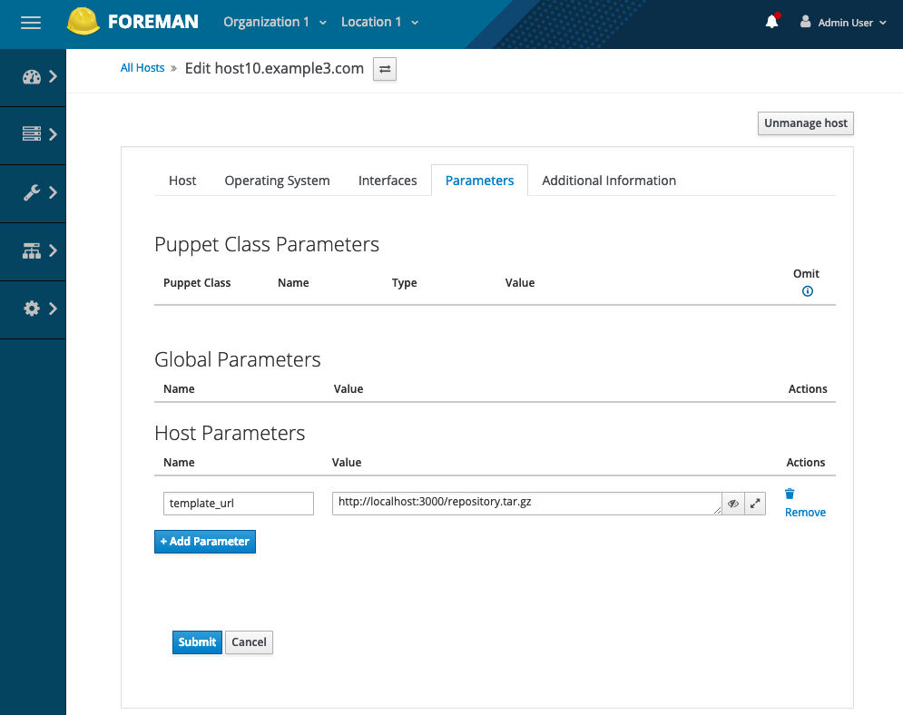

# ForemanGitTemplates

[](https://www.dmtech.de/)

This is a plugin for Foreman that adds support for using templates from Git repositories.

## Installation

See [Plugins install instructions](https://theforeman.org/plugins/) for how to install Foreman plugins.

## Usage

Repositories are fetched as tarball files and must have a specific file structure. Only one template for template kind is supported however multiple snippets are supported, for example:

```
.
└── templates
    ├── PXELinux
    │   └── my_pxelinux_template.erb
    ├── provision
    │   └── my_provision_template.erb
    └── snippet
        ├── snippet_1.erb
        └── snippet_2.erb
```

In order to use templates from the repository you have to set `template_url` host parameter (specify the HTTP authentication credentials if necessary). To set host parameters navigate to the edit host page and open "Parameters" tab.



From now the template content for this host will be fetched from the repository. To test this open `/unattended/provision?spoof=<host_ip>`. The template stored in the `provision` directory should be rendered.

### Troubleshooting

- `There was an error rendering the provision template: Cannot fetch repository from <template_url>. Response code: 404`
  - check if the URL is correct
- `There was an error rendering the provision template: Cannot read <template> from repository`
  - check if there is requested template in the repository

## Contributing

Fork and send a Pull Request. Thanks!

## Copyright

Copyright (c) 2018 dmTECH GmbH, [dmtech.de](https://www.dmtech.de/)

This program is free software: you can redistribute it and/or modify
it under the terms of the GNU General Public License as published by
the Free Software Foundation, either version 3 of the License, or
(at your option) any later version.

This program is distributed in the hope that it will be useful,
but WITHOUT ANY WARRANTY; without even the implied warranty of
MERCHANTABILITY or FITNESS FOR A PARTICULAR PURPOSE.  See the
GNU General Public License for more details.

You should have received a copy of the GNU General Public License
along with this program.  If not, see <http://www.gnu.org/licenses/>.
